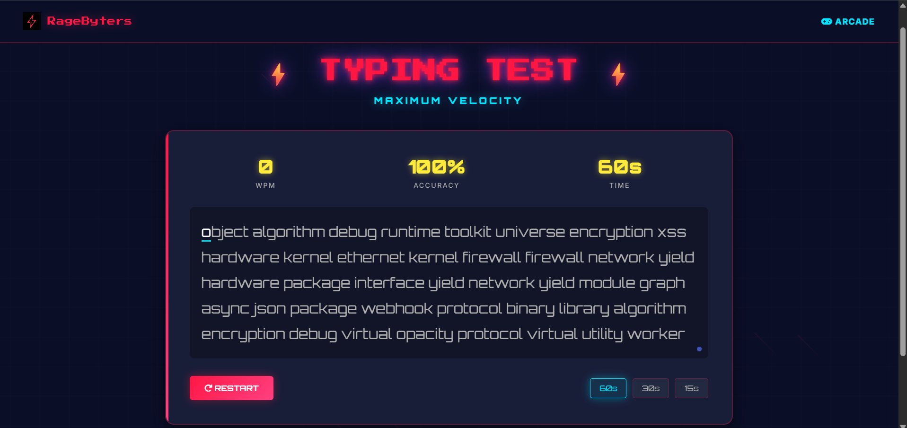

# TYPING TEST Web Application

## Description
A high-octane, retro-themed web application designed for true gamers to measure their typing speed and accuracy. Part of the RageByters Arcade, this tool focuses on pure performance and real-time feedback.

## Live Demo
Check out the live version here: [RageByters Typing Test](https://ragebyters.github.io/utilty-typing-test/)

## Features
* **Real-Time WPM Tracking:** Dynamically calculates your Words Per Minute as you type.
* **Precision Analytics:** Monitors your accuracy percentage and highlights mistakes in real-time.
* **Adjustable Difficulty:** Choose between 15s, 30s, and 60s battle durations.
* **Battle Report & Charting:** View your performance history with an integrated WPM line chart using Chart.js.
* **Retro Visuals:** Features a custom canvas-based grid background and responsive CSS animations.

## Technologies Used
* **HTML5:** Structural layout for the typing interface and arcade components.
* **CSS3:** Custom styling with CSS variables, retro grid effects, and responsive design.
* **JavaScript (Vanilla):** Core game logic, timer management, and WPM/Accuracy calculations.
* **Chart.js:** For rendering the visual performance report at the end of each session.
* **AOS (Animate On Scroll):** For smooth UI entrance animations.

## Getting Started
To run this project locally:
1. Clone the repository to your machine.
2. Open the `index.html` file in any modern web browser.
3. Start typing in the input area to trigger the timer automatically.

## Contributing
Contributions are welcome! If you have suggestions for new arcade features or find a bug, please open an issue first or submit a pull request directly.

---
*RageByters © 2026 | Built for pure performance.*