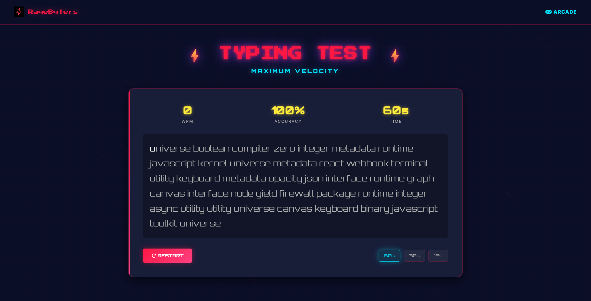
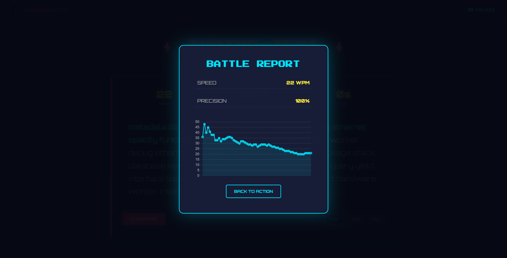

# ⚡ Typing Test

A web-based typing test game with an arcade-inspired interface that measures typing speed and accuracy in real time.

Users type randomly generated words against a countdown timer and receive instant feedback on performance, including WPM trends and accuracy statistics.

---

## 📸 Screenshots

### Typing Test Interface


### Results Summary


---

## 🚀 Features

- Words Per Minute (WPM) tracking
- Accuracy percentage calculation
- Countdown timer (15s / 30s / 60s modes)
- Real-time character validation (correct / incorrect)
- Results modal with final statistics
- WPM performance chart at the end of each test
- Retro animated canvas background
- Responsive, arcade-style UI

---

## 🛠️ Technologies Used

- **HTML** – application structure
- **CSS** – styling, layout, and animations
- **JavaScript** – game logic and statistics
- **Chart.js** – WPM progress visualization
- **Canvas API** – animated background effects
- **AOS (Animate on Scroll)** – UI animations

---

## ▶️ Running the Project Locally

### Prerequisites
- A modern web browser (Chrome, Firefox, Edge, etc.)

### Steps

1. Clone the repository:
   ```bash
   git clone https://github.com/<your-username>/utility-typing-test.git
   ```
2. Navigate into the project directory.
3. Open `index.html` in your browser.

No build tools or dependencies are required.

---

## 📂 Project Structure

```
.
├── index.html
├── css/
│   └── style.css
├── js/
│   ├── script.js
│   └── background.js
└── README.md
```

---

## 🤝 Contributing

Contributions are welcome!

If you’d like to improve the project, feel free to fork the repository, create a new branch, and submit a pull request. Bug fixes, enhancements, and documentation improvements are all appreciated.

---

## 📄 License

This project is licensed under the MIT License.
